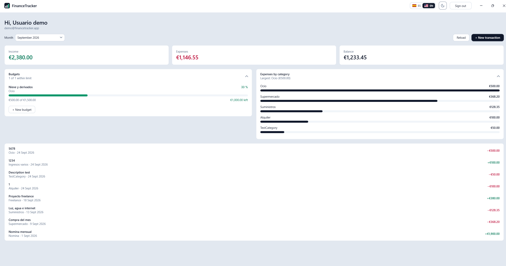
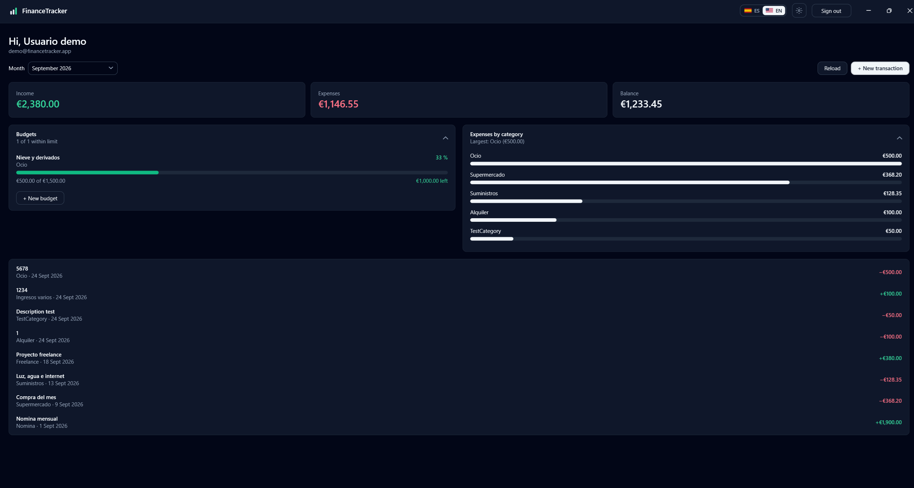
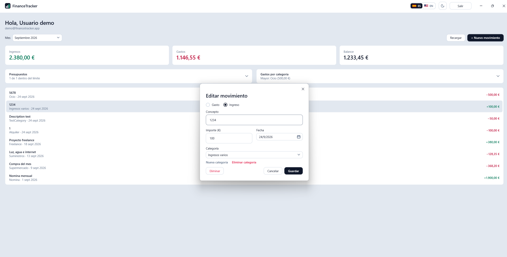
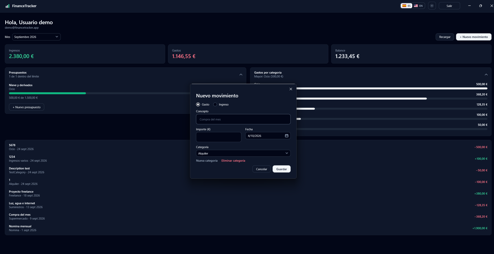
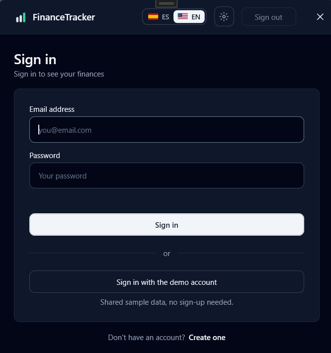

# 🖥️ FinanceTracker Desktop

[English](README.md) · **Español**

Cliente de escritorio para Windows de [FinanceTracker](https://github.com/antonicr1986/FinanceTracker),
una API REST de finanzas personales escrita en .NET 8.

**Es el tercer cliente de esa API**, después de
[financetracker-web](https://github.com/antonicr1986/financetracker-web) (Next.js)
y [financetracker-android](https://github.com/antonicr1986/financetracker-android)
(Kotlin). Cada uno llega a los mismos endpoints, códigos de error y reglas de
negocio desde una plataforma distinta. Este cierra el círculo en el mismo
lenguaje que la API: C# en los dos extremos.

Hay una **cuenta de demostración pública**, la misma que usan la web y Android,
a un clic desde la pantalla de acceso. La API se duerme tras 20 minutos sin uso,
así que el primer acceso del día puede tardar mientras se despiertan el
servicio y la base de datos — la ventana lo avisa mientras espera.

**La forma recomendada es instalarla desde Microsoft Store**, para Windows 10
u 11 (x64 y ARM64): se instala con un clic, sin avisos de SmartScreen, y se
actualiza sola. Microsoft firma el paquete (MSIX) al publicarlo.

También puedes **[descargarla desde GitHub](https://github.com/antonicr1986/financetracker-desktop/releases/latest)**
sin pasar por la Store, para Windows 10 u 11 (64 bits), con .NET incluido, así
que no hay nada que instalar. La descarga recomendada es el `.zip`: descomprímelo y ejecuta
`FinanceTracker.Desktop.exe`. También hay un `.exe` único.

Esa versión no está firmada, así que el navegador y Windows pueden
poner avisos. Son los esperados; para pasarlos:

1. **Conserva la descarga.** En Edge: **…** → **Conservar** → **Mostrar más** →
   **Conservar de todos modos**. En Chrome: **Conservar**.
2. **Desbloquéala antes de abrirla.** Clic derecho en el `.zip` →
   **Propiedades** → marca **Desbloquear** → **Aceptar**. Hacerlo en el `.zip`
   *antes* de descomprimir desbloquea todos los archivos de dentro.
3. Si aún aparece SmartScreen: **Más información** → **Ejecutar de todas
   formas**.

## ✨ Qué hace

- **Acceso con JWT** contra la API desplegada, con mensajes claros para una
  contraseña incorrecta y para un fallo de conexión.
- **Entrada a la cuenta de demostración con un clic**, sin rellenar el
  formulario.
- **Una sesión que sobrevive a cerrar la aplicación.** El token se guarda
  cifrado con DPAPI de Windows, así que la aplicación se abre directamente en
  el panel mientras sigue valiendo; cuando ha caducado, se abre en el acceso
  con un aviso. Salir lo borra.
- **Registro de cuentas**, como en la web y Android: nombre, correo, contraseña
  y su repetición, validados en el orden de Android antes de llamar a la API.
  Se envía el idioma de la interfaz, para que las categorías de partida lleguen
  en español o en inglés. La API devuelve el usuario creado y no un token, así que la aplicación inicia
  sesión con las mismas credenciales y abre el panel. "¿No tienes cuenta? Crear
  una" y "¿Ya tienes cuenta? Entrar" enlazan las dos pantallas.
- **Textos de ayuda dentro de las cajas vacías** (`tu@email.com`,
  `Tu contraseña`), que desaparecen en cuanto se escribe algo.
- **Selector de mes** con todos los meses que tienen datos, del más reciente
  al más antiguo.
- **Totales del mes elegido** — ingresos, gastos y balance — calculados en el
  cliente sobre todo el historial, como en los otros clientes.
- **Lista de movimientos** con categoría, fecha e importe con signo y color.
- **Alta de movimientos** desde el panel, en un diálogo con tipo, descripción,
  importe, fecha y categoría. Solo se ofrecen las categorías del tipo elegido:
  la API rechaza un gasto con una categoría de ingreso. El importe acepta coma
  o punto para los decimales.
- **Crear una categoría desde el diálogo de movimiento**, como en la web y
  Android: un enlace "Nueva categoría" abre una caja con Añadir y Cancelar. La
  categoría toma el tipo del movimiento — el único con el que la API la
  aceptaría — y queda elegida al crearla. La API no rechaza nombres repetidos,
  así que lo hace el cliente: mismo tipo, sin distinguir mayúsculas ni espacios
  de los extremos, de modo que "Regalos" puede existir como gasto y como
  ingreso.
- **Eliminar una categoría** desde el mismo diálogo: "Eliminar categoría" borra
  la elegida en el desplegable, tras preguntar. Solo afecta a las categorías del
  usuario que ha iniciado sesión — la API filtra todas las operaciones de
  categorías por el usuario del token, así que una categoría de otra cuenta
  responde 404 como si no existiera. Una categoría que todavía tiene
  movimientos no se puede eliminar; la API lo rechaza y la aplicación muestra
  el motivo, con el mensaje de la web.
- **Confirmaciones con el estilo de la aplicación.** Eliminar un movimiento o
  una categoría pregunta en un diálogo pequeño de la propia aplicación —
  colores del tema en claro y en oscuro, sin barra de título de Windows, el
  "Sí, eliminar" de la web en rojo, y el foco en Cancelar para que un Enter
  despistado no borre nada.
- **Edición y borrado de movimientos**: doble clic lo abre relleno en el mismo
  diálogo; borrar pide confirmación antes. Tras guardar, el panel se recarga y
  muestra el mes de ese movimiento.
- **Temas claro y oscuro**, que se cambian desde la barra superior con los
  mismos iconos de luna y sol que la web, y se recuerdan entre sesiones.
  Mientras no se elige, la aplicación sigue el ajuste de Windows, como Android
  sigue el del teléfono, y lo sigue también si Windows cambia con la aplicación
  abierta. La barra de título también se oscurece.
- **Español e inglés**, que se cambian desde la barra superior con el mismo
  selector de dos botones que la web — bandera y código, el activo relleno — y
  se recuerdan entre sesiones. Mientras no se elige, la aplicación sigue el
  idioma de Windows, igual que la web sigue el del navegador. Todos los textos
  cambian a la vez, también un error que ya esté en pantalla, sin reiniciar y
  sin volver a llamar a la API. Los textos reutilizan las frases y claves de la
  web; importes y fechas siguen al idioma (`es-ES` / `en-GB`), siempre en euros.
- **La misma estética que la web**: la escala slate de Tailwind, tarjetas
  blancas sobre fondo gris (tarjetas slate sobre casi negro en oscuro), la
  acción principal en slate-900 (invertida en oscuro) y una barra superior
  común a todas las ventanas, con el nombre a la izquierda y el idioma, el
  tema y "Salir" a la derecha — "Salir" deshabilitado en la pantalla de acceso,
  como en los otros clientes.
- **Una barra en lugar de dos.** La barra superior de la aplicación es también
  la barra de título de la ventana, así que "FinanceTracker" no aparece dos
  veces, igual que en la web y en Android, que tienen una sola barra. Sigue
  moviendo la ventana al arrastrarla, maximiza con doble clic y se ajusta a los
  bordes de la pantalla, y lleva sus propios botones de minimizar, maximizar y
  cerrar con los iconos y tamaños de Windows.
- **El mismo icono que la app Android** — tres barras ascendentes, la más alta
  en el verde de ingresos, sobre slate-900 — en la barra de título, la barra de
  tareas, el ejecutable y junto al nombre en la barra superior. El `.ico`
  contiene nueve tamaños, de 16 a 256 píxeles, para que Windows elija uno
  nítido en cada sitio; la barra superior lo dibuja en vectorial.
- **Presupuestos mensuales** en el panel, como en la web y Android: gastado de
  total, una barra que se pone ámbar al 80 % y roja al 100 %, y lo que queda o
  lo que se ha pasado, con "1 de 2 dentro del límite" como resumen. Todas las
  cifras las calcula la API; la aplicación solo elige los del mes y los pinta.
- **Alta, edición y borrado de presupuestos**, como en los otros clientes:
  nombre, gasto o ingreso, importe, mes (doce antes y doce después, como
  Android) y categoría — primero "Todas las categorías", que cubre todo el
  tipo. Uno nuevo se propone para el mes que se está viendo; un clic en un
  presupuesto lo abre relleno, con Eliminar y la confirmación de la aplicación.
  Al guardar, el panel se recarga, salta a ese mes y abre la sección.
- **Gastos por categoría**: los gastos del mes agrupados por categoría, de
  mayor a menor, cada uno con una barra relativa a la mayor, y "Mayor: …" como
  resumen.
- **Secciones plegables**, plegadas la primera vez, cuyo resumen de una línea
  sigue a la vista al plegarlas, así que el panel se abre compacto y aun así
  dice lo importante. Cómo se dejan se recuerda en `settings.json`. Presupuestos y desglose van uno al lado del otro, porque en
  escritorio sobra ancho, y todo el panel se desplaza como una sola página,
  como en Android.
- **Estados de carga, error y vacío**, con botón de reintentar, y un mensaje
  claro cuando la sesión caduca en lugar de volver al acceso sin explicación.

## 🖼️ Vista previa

El panel en tema claro y oscuro: los totales del mes, presupuestos y gastos por
categoría uno al lado del otro, y los movimientos.

  
  

Editar un movimiento y registrar uno nuevo, cada uno en su diálogo y sin salir
del panel. En el tema oscuro se ven además los presupuestos y los gastos por
categoría desplegados.

  
  

La pantalla de acceso, con la entrada a la cuenta de demostración en un clic y
el cambio de idioma y de tema en la barra de título única.

## 🧰 Tecnologías

- **.NET 8** y **WPF**
- **MVVM** con [CommunityToolkit.Mvvm](https://learn.microsoft.com/dotnet/communitytoolkit/mvvm/)
- **HttpClient** con `System.Net.Http.Json`
- **xUnit** para las pruebas

## 📁 Estructura

    FinanceTracker.Desktop/
      Domain/       Meses, totales, presupuestos, desglose y reglas del formulario — sin WPF
      Localization/ Textos en los dos idiomas, el Localizer y el cambio de idioma
      Controls/     Hint.Text, el texto de ayuda de las cajas
      Assets/       app.ico, generado a partir del vector del icono de Android
      Models/       Los DTOs de la API, como records
      Services/     Cliente HTTP, sesión, diálogos y el tipo de error
      ViewModels/   La lógica de cada pantalla, sin referencias a controles
      Themes/       Light.xaml y Dark.xaml (colores), Controls.xaml (plantillas)
      Views/        Ventanas XAML y la barra superior común, con el code-behind casi vacío
      App.xaml.cs   Crea los servicios y decide qué ventana se ve
    FinanceTracker.Desktop.Tests/
                    Pruebas de los ViewModels, sin ventanas ni red

## 🧠 Decisiones que merece la pena leer

**Los ViewModels no abren ventanas.** Un ViewModel lanza un evento
(`LoggedIn`, `LoggedOut`) y es `App.xaml.cs` quien navega. Así los ViewModels
no tienen ninguna referencia a ventanas de WPF y se pueden probar como clases
normales.

**Los ViewModels tampoco abren diálogos.** Preguntar "¿seguro?" con
`MessageBox` desde un ViewModel lo haría imposible de probar. Se lo piden a un
`IDialogService`: la implementación de la aplicación abre ventanas de verdad, y
la de las pruebas responde sí o no a demanda, así que "el usuario dijo que no y
no se borró nada" es una prueba unitaria normal.

**Un solo diálogo para crear y editar.** `TransactionEditorViewModel` recibe el
movimiento existente o nada. La misma ventana, la misma validación y los mismos
errores de la API, con el botón de borrar solo al editar — como en la web y en
Android.

**El ViewModel de acceso depende de una interfaz, no del cliente HTTP.**
`LoginViewModel` recibe un `IAuthService`. La aplicación le pasa el `ApiClient`
real; las pruebas, uno falso que responde al instante, y así se cubren todos
los casos de error sin servidor.

**Los errores se deciden por código, nunca por texto.** La API responde con
`ProblemDetails` y un `code` estable (`invalid_credentials`…). El cliente lo
convierte en una `ApiException` con ese código, y solo el ViewModel elige la
frase que se muestra — la misma regla que en la web y en Android.

**La contraseña es la única excepción a "nada en el code-behind".** WPF no
permite hacer binding de `PasswordBox.Password`, a propósito, para que la
contraseña no quede en una propiedad enlazable. La ventana se la pasa al
ViewModel en un manejador de dos líneas.

**WPF no tiene placeholder, así que hay uno pequeño.** `Controls/Hint.cs` es una
propiedad adjunta — una propiedad que se puede poner en un control que no la
tiene — y se usa como `<TextBox controls:Hint.Text="tu@correo.com" />`. Las
plantillas de las cajas de texto y de contraseña la pintan dentro de la caja,
en la misma celda que el texto real. Dónde empieza el texto dentro de una caja
no es un número fijo — WPF deja su propio hueco antes del cursor, y cambia con
la escala de pantalla de Windows —, así que en vez de adivinarlo, `Hint` mide
dónde iría el primer carácter con `GetRectFromCharacterIndex(0)` y coloca la
ayuda justo ahí. Dos versiones anteriores adivinaban ese hueco y el cursor
quedaba entre la primera y la segunda letra de la ayuda. Como `PasswordBox` no deja ver su
contenido a los triggers, la propiedad adjunta también mantiene al día un
indicador `Hint.IsEmpty` desde `PasswordChanged`.

**Un 401 significa dos cosas distintas.** En el acceso todavía no hay sesión,
así que es una contraseña incorrecta. En el panel había un token y la API lo
ha rechazado, así que la sesión ha caducado. Al cliente HTTP se le dice cuál
corresponde en cada llamada.

**Las fechas nunca se convierten.** La API envía `2026-09-01T00:00:00` sin zona
horaria, así que .NET la lee como `DateTimeKind.Unspecified` y no la toca: el
día 1 de un mes sigue en ese mes esté donde esté el usuario.

**Un tema es un diccionario que se sustituye.** `Light.xaml` y `Dark.xaml`
definen las mismas claves (`Brush.Surface`, `Brush.Text`, `Brush.Income`…) con
los colores de la web. Al cambiar, uno reemplaza al otro en los recursos de la
aplicación, y todo lo que los lee con `{DynamicResource}` se repinta en el acto,
sin reiniciar ni parpadear. Hasta el icono que muestra el botón de tema es un
recurso (`Visibility.Moon`/`Visibility.Sun`), igual que la web lo decide en CSS
y no en código.

**Hubo que rehacer las plantillas de los controles de WPF.** Botones, cajas de
texto, desplegables, el selector de fecha, las filas de la lista y las barras
de desplazamiento vienen con el aspecto clásico de Windows y colores fijos, así
que en oscuro seguirían blancos. `Controls.xaml` da a cada uno una plantilla
pequeña que toma sus colores del tema, con las esquinas de 8 píxeles de la web.
La barra de título la pinta Windows, no WPF, así que se oscurece con
`DwmSetWindowAttribute`.

**Un idioma también es un diccionario que se sustituye.** `Strings.cs` tiene
todos los textos en los dos idiomas, en C#. `LanguageManager` convierte el
elegido en un diccionario de recursos y lo pone en el tercer hueco de la
aplicación, así que el XAML lee `{DynamicResource dashboard.income}` y se
repinta igual que con el tema. Los ViewModels obtienen los mismos textos de un
`Localizer` que reciben en el constructor, y escuchan su evento `Changed` para
rehacer lo que construyen ellos — nombres de meses, importes, fechas, el
saludo.

**Los errores se guardan como "cómo escribirlos", no como texto.** Un ViewModel
guarda una `Func<string>` para el error actual. Al cambiar de idioma se vuelve a
ejecutar, así que un mensaje en pantalla no se queda en el otro idioma.

**El inglés es `en-GB` con el euro fijado**, como en la web: `en-US` pondría el
mes antes que el día, y `en-GB` por sí solo mostraría libras.

**La barra de título es nuestra, con `WindowChrome`.** Le dice a Windows que no
dibuje la barra de título y que trate los 56 píxeles de arriba como si lo
fueran: arrastrar, doble clic y ajustar a los bordes siguen funcionando. Todo
lo que se pulsa en esa franja lleva `WindowChrome.IsHitTestVisibleInChrome`; si
no, el clic arrastraría la ventana. Una ventana maximizada con `WindowChrome`
se sale de la pantalla por cada lado lo que mide su borde invisible de
redimensionar, así que la barra superior añade al contenido un margen de
`SystemParameters.WindowResizeBorderThickness` mientras está maximizada. Los
diálogos de movimiento y de confirmación hacen lo mismo en pequeño: su propia
fila de título es la barra que se arrastra, así que "Nuevo movimiento" tampoco
aparece dos veces.

**Las cifras de los presupuestos vienen de la API.** `SpentAmount`,
`RemainingAmount` y `UsagePercentage` los calcula la API a partir de los
movimientos; el cliente nunca los deriva. Por eso guardar un movimiento recarga
también los presupuestos: lo gastado ha cambiado. El porcentaje se redondea
alejándose del cero, como lo escribe la web — .NET redondea al par por
defecto, así que 80,5 se quedaría en 80.

**Un solo desplazamiento, no dos.** La lista de movimientos ha perdido su
`ScrollViewer` propio: una lista con scroll dentro de una página con scroll se
queda la rueda del ratón en cuanto el puntero está encima, y la página deja de
moverse.

**Nada de `MessageBox`.** El cuadro de mensaje de Windows ignora el tema de la
aplicación y escribe su "Sí/No" en el idioma de Windows, no en el elegido en la
aplicación. `ConfirmWindow` lo sustituye; los ViewModels siguen llegando a él
solo a través de `IDialogService.Confirm`, así que sus pruebas responden sí o no
sin ninguna ventana.

**"Todas las categorías" es una opción, no una ausencia.** En el diálogo de
presupuesto es una entrada de verdad con `Id = null`, la forma de la API de
decir "todo el tipo" — no "sin categoría". Se rehace con el idioma y se vuelve a
elegir al cambiar el tipo si la categoría anterior ya no encaja.

**Enter crea la categoría, no el movimiento.** En WPF, Enter pulsa el botón
por defecto del diálogo — Guardar. Mientras se escribe una categoría nueva,
Añadir pasa a ser el botón por defecto y Guardar deja de serlo, así que Enter
nunca guarda un movimiento a medio rellenar. La web tuvo que interceptar la
misma tecla por el mismo motivo.

**Una categoría sobrevive a un diálogo cancelado.** Una vez creada, existe en
la API aunque luego se cancele el movimiento, así que el panel la añade a su
lista en el acto en lugar de esperar a la próxima recarga.

**La sesión guardada se cifra con DPAPI, no con una clave nuestra.**
`DpapiSessionStore` escribe el token y el usuario en
`%LocalAppData%\FinanceTracker\session.dat` a través de `ProtectedData`, que
cifra con una clave ligada a la cuenta de Windows y que guarda el propio
Windows. Copiado a otro equipo o a otra cuenta, el archivo no se puede
descifrar, y no hay ninguna clave en el código. Al arrancar,
`Session.TryRestore` compara la caducidad guardada — en UTC, como la calcula la
API — con la hora actual, con un margen de dos minutos para que el token no
caduque a mitad de la primera carga. Un archivo roto o de otra cuenta cuenta
como sin sesión y se borra.

**La decisión del tema es C# normal.** `ThemePreference` decide qué tema toca
(el elegido, o el de Windows si no hay elección) sin ninguna referencia a WPF,
así que tiene pruebas unitarias; `ThemeManager` solo pinta. La elección se
guarda en `%LocalAppData%\FinanceTracker\settings.json`, aparte de la sesión,
para que cerrar sesión no la reinicie.

**El tiempo de espera es de 120 segundos, no los 100 por defecto.** Despertar
el plan gratuito de App Service y la base de datos serverless pausada a la vez
puede pasar de 100 segundos en la primera petición del día.

## 🧪 Pruebas

`dotnet test` — 160 pruebas, sin ventanas ni red.

Veinticinco cubren los ViewModels. Acceso: campos vacíos, éxito, contraseña
incorrecta, sin conexión, y el botón de la demo, que usa sus credenciales sin
tocar ni exigir el formulario. Panel: se elige el mes más reciente, cambio de mes,
sin datos, errores, sesión caducada, cierre de sesión, y que al guardar se
recarga y salta al mes del movimiento mientras que cancelar no recarga. El
diálogo de movimiento: valores iniciales de uno nuevo, categorías filtradas por
tipo, el cuerpo exacto que se envía, edición por id, borrar pregunta antes y no
hace nada si se dice que no, y los errores de la API dejan el diálogo abierto.

Diez cubren la sesión guardada: se guarda al iniciar sesión y se borra al salir,
se recupera mientras vale, se avisa y se olvida al caducar, un token a punto de
caducar cuenta como caducado, una caducidad sin zona horaria se lee como UTC, y
— con DPAPI de verdad sobre un archivo temporal — que se guarda y se lee bien,
que el token y el correo no se pueden leer en el archivo, que un archivo roto se
ignora y se borra, y el borrado.

Quince cubren el registro: los problemas en el orden de Android, qué cuenta como
correo, registrar y luego iniciar sesión con el nombre y el correo recortados,
un formulario no válido o un correo ya en uso que se paran antes del inicio de
sesión, el idioma de la interfaz enviado para las categorías de partida, el
mensaje genérico para otros errores, un error reescrito al cambiar de
idioma, los enlaces entre las dos pantallas, y el cuerpo de
`POST /api/Users/register` enviado sin token y con su código
`email_already_exists` conservado.

Dieciséis cubren el diálogo de presupuesto: doce meses a cada lado cruzando de
año, los problemas del formulario en orden, uno nuevo para el mes que se ve con
"Todas las categorías", el cuerpo exacto (mes, año, tipo y una categoría nula),
el tipo ingreso ofreciendo solo categorías de ingreso y volviendo a "Todas",
la edición por id centrada en el mes del propio presupuesto, el borrado solo
tras la confirmación de la aplicación, cada error de la API explicado con el
diálogo abierto, el cambio de idioma que rehace los meses y "Todas las
categorías" sin perder lo elegido, el panel que recarga, salta al mes y abre la
sección tras guardar, y las peticiones `POST`, `PUT` y `DELETE` con el cuerpo que
espera la API.

Nueve cubren el borrado de categorías: los dos borrados preguntan con el "Sí,
eliminar" traducido de la propia aplicación, pregunta antes y quita la elegida, no hace
nada si se dice que no, una categoría con movimientos se mantiene y se muestra
el motivo de la API, una que ya no existía se quita igualmente, el enlace se
deshabilita si no hay ninguna categoría de ese tipo, una creada y borrada en el
mismo diálogo no se vuelve a ofrecer, y la petición `DELETE` sale con el token
y conserva su código `category_has_transactions`.

Doce cubren la creación de categorías: los duplicados del mismo tipo (con otras
mayúsculas o espacios) se paran antes de llamar a la API, el mismo nombre se
permite en el otro tipo, se envía el tipo del movimiento y la nueva queda
elegida, un nombre vacío, un fallo de la API que deja la caja abierta,
cancelar, el aviso de "ninguna categoría de este tipo", una categoría creada en
un diálogo cancelado que se ofrece la vez siguiente sin recargar, y el cuerpo
exacto de `POST /api/Categories`.

Veintitrés cubren presupuestos y desglose: solo los presupuestos del mes elegido
(no los del mismo mes de otro año), el redondeo, los cortes de color del 80 %
y el 100 %, "dentro del límite" incluido uno justo en el límite, la barra
limitada al pasarse, "Todas las categorías" para un presupuesto sin categoría,
solo gastos y de mayor a menor en el desglose con barras relativas a la mayor,
los resúmenes vacíos, que las secciones empiezan plegadas y recuerdan cómo se
dejaron sin tocar los otros ajustes, los textos de los
presupuestos reescritos al cambiar de idioma, y el endpoint de presupuestos
leído como un array normal con una categoría nula.

Quince cubren los idiomas. Los dos diccionarios deben tener exactamente las
mismas claves y ningún texto vacío — olvidar una traducción rompe la
compilación, como en la web. Otra prueba lee los archivos XAML y comprueba que
cada clave de texto de `{DynamicResource}` existe, porque WPF muestra una que
falta como un texto vacío sin avisar. El resto comprueban los euros en los dos
idiomas (`12.345,60 €` y `€12,345.60`), que se sigue el idioma de Windows hasta
que se elige uno, y el cambio con las pantallas abiertas: el panel rehace sus
meses, importes y saludo sin volver a llamar a la API, un error en pantalla se
reescribe, y un diálogo cerrado deja de escuchar.

Siete cubren el tema: se sigue a Windows hasta que se elige, el cambio parte
de lo que se ve y se guarda, una vez elegido se ignora Windows, un valor
guardado desconocido cuenta como sin elegir, y el archivo de ajustes se guarda
y se lee bien y vuelve a los valores por defecto si falta o está roto.

Trece cubren las reglas del formulario (importes con coma o punto, el
separador de miles rechazado por ambiguo, el orden en que se avisan los
problemas), cinco la lógica de meses, incluido el día 1 y una lista que cruza de
año, y dos que un mes y una categoría muestran su nombre en un desplegable
cerrado y no el volcado por defecto del record.

Ocho comprueban el cliente HTTP contra un `HttpMessageHandler` falso: se piden
todas las páginas con el token y `pageSize=100`, el JSON exacto de un
movimiento nuevo, `PUT` y `DELETE` respondidos con 204 sin cuerpo, un 404 y un
`category_type_mismatch` convertidos en su código, y un 401 que es "contraseña
incorrecta" o "sesión caducada" según la llamada.

## 🔄 Automatización

- **CI** en cada push y pull request, en `windows-latest` porque WPF solo
  compila en Windows: comprobación de formato con `dotnet format` frente a
  `.editorconfig` (lint), una comprobación que falla si algún paquete NuGet
  tiene vulnerabilidades conocidas (también los transitivos), compilación,
  pruebas y la aplicación publicada,
  descargable desde la propia ejecución.
- El número de pruebas se escribe en el resumen de la ejecución, y **cero
  pruebas hace fallar el build**: unas pruebas que dejan de ejecutarse sin
  avisar son peores que unas en rojo.
- **Dependabot** abre cada mes una pull request con las actualizaciones menores
  y de parche de los paquetes NuGet y de las acciones, agrupadas en una; las
  versiones mayores se dejan para decidirlas a mano.
- **Release** en cada etiqueta de versión (`v1.2.3`): pasa las pruebas, publica
  la aplicación autocontenida dos veces — como carpeta dentro de un `.zip`, y
  como un único `.exe` — con la versión sacada de la etiqueta, comprueba que la
  versión ha llegado de verdad a los dos ejecutables, y publica una Release de
  GitHub con los dos archivos, los pasos para desbloquearlos y un changelog
  desde la etiqueta anterior. El mismo modelo de entrega que la app Android; la
  versión nunca se edita a mano. El `.zip` es el recomendado porque los
  navegadores desconfían menos de él que de un `.exe` suelto, y una carpeta de
  archivos normales parece menos sospechosa a Defender que un ejecutable que se
  descomprime a sí mismo al arrancar.
- **Microsoft Store**: un proyecto de empaquetado MSIX
  (`FinanceTracker.Desktop.Package`, en `FinanceTracker.Desktop.Store.slnx`)
  genera el paquete para x64 y ARM64 con un solo comando de MSBuild; la Store lo
  firma al publicarlo. El CI usa `FinanceTracker.Desktop.slnx`, sin ese proyecto,
  porque solo compila con el MSBuild de Visual Studio, no con `dotnet build`.
- **Escaneo de secretos** con gitleaks sobre todo el historial, con la misma
  configuración que el resto de repositorios del proyecto y una regla más para
  credenciales escritas a mano en C#.

## ⚙️ Ejecutarlo en local

Windows, el SDK de .NET 8 y Visual Studio 2022 o cualquier editor.

    dotnet build
    dotnet test
    dotnet run --project FinanceTracker.Desktop

La URL de la API es `ApiClient.BaseUrl`, en `Services/ApiClient.cs`.

## ✍️ Autor

Antonio Company - [GitHub](https://github.com/antonicr1986) ·
[LinkedIn](https://www.linkedin.com/in/antoniocompany/)
