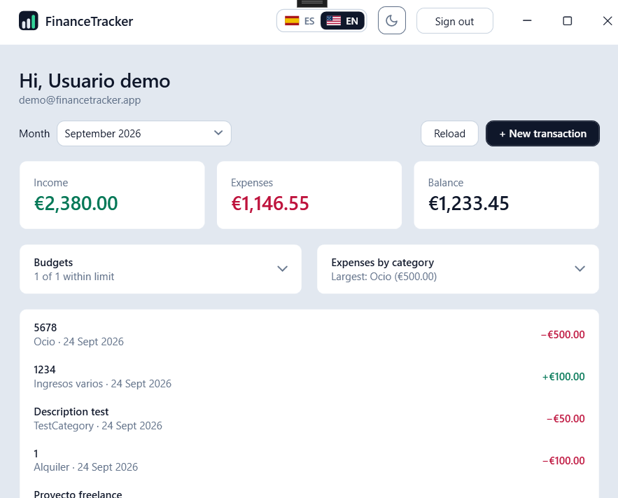
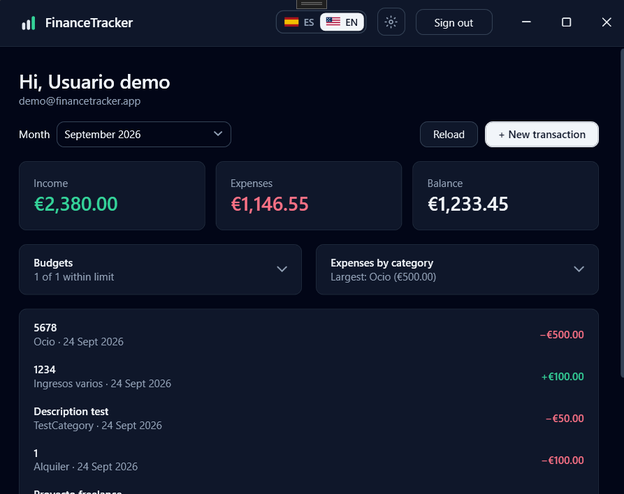
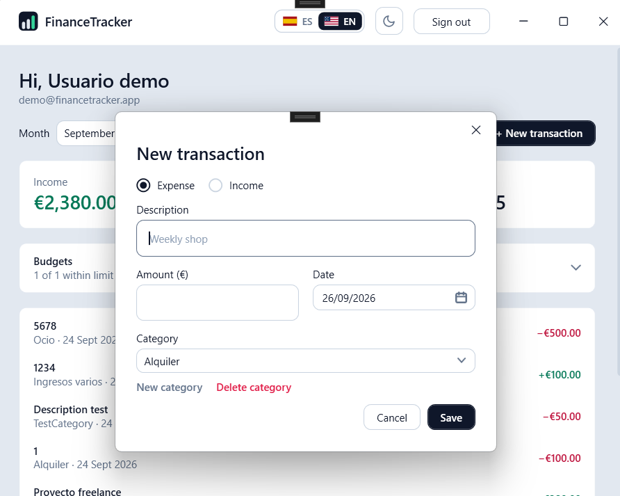
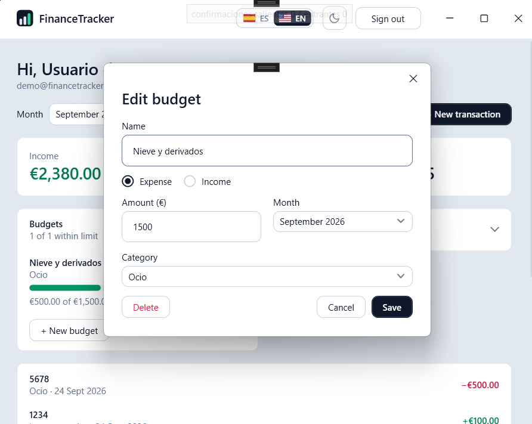

# 🖥️ FinanceTracker Desktop

**English** · [Español](README.es.md)

Windows desktop client for [FinanceTracker](https://github.com/antonicr1986/FinanceTracker),
a personal finance REST API written in .NET 8.

**This is the third client of that API**, after
[financetracker-web](https://github.com/antonicr1986/financetracker-web) (Next.js)
and [financetracker-android](https://github.com/antonicr1986/financetracker-android)
(Kotlin). Each one reaches the same endpoints, error codes and business rules
from a different platform. This one closes the circle in the same language as
the API: C# on both ends.

There is a **public demo account**, the same one the web and Android clients
use, reachable in one click from the sign-in screen. The API sleeps after 20
minutes of inactivity, so the first sign-in of the day can take a while as the
app service and the database wake up — the window says so while it waits.

**[Download the latest version](https://github.com/antonicr1986/financetracker-desktop/releases/latest)**
for Windows 10 or 11 (64-bit), with .NET bundled, so there is nothing to
install. The `.zip` is the recommended download: unzip it and run
`FinanceTracker.Desktop.exe`. A single `.exe` is there too.

The app is not code-signed and is new, so the browser and Windows may put up
warnings. They are expected; to get past them:

1. **Keep the download.** In Edge: **…** → **Keep** → **Show more** → **Keep
   anyway**. In Chrome: **Keep**.
2. **Unblock it before opening.** Right-click the `.zip` → **Properties** →
   tick **Unblock** → **OK**. Doing it on the `.zip` *before* extracting
   unblocks every file inside.
3. If SmartScreen still appears: **More info** → **Run anyway**.

## ✨ What it does

- **Sign-in with JWT** against the deployed API, with clear messages for a
  wrong password and for a connection failure.
- **One-click entry into the demo account**, without filling in the form.
- **A session that survives closing the app.** The token is kept encrypted
  with Windows' DPAPI, so the app opens straight on the dashboard while it is
  valid; once it has expired, it opens on sign-in with a notice. Signing out
  deletes it.
- **Account registration**, as in the web and Android clients: name, email,
  password and its repetition, validated in Android's order before calling the
  API. The API returns the new user and not a token, so the app then signs in
  with the same credentials and opens the dashboard. The interface language is
  sent too, so the starter categories come in Spanish or English. "Don't have an account?
  Create one" and "Already have an account? Sign in" link the two screens.
- **Hints inside the empty fields** (`tu@email.com`, `Tu contraseña`), which
  disappear as soon as something is typed.
- **Month selector** with every month that has data, newest first.
- **Totals for the selected month** — income, expenses and balance — derived
  on the client from the full history, as in the other clients.
- **Transaction list** with category, date and a signed, coloured amount.
- **Recording a transaction** from the dashboard, in a dialog with the type,
  description, amount, date and category. Only categories of the chosen type
  are offered: the API rejects an expense filed under an income category. The
  amount accepts a comma or a dot for decimals.
- **Creating a category from the transaction dialog**, as in the web and
  Android clients: a "New category" link opens a box with Add and Cancel. The
  category takes the transaction's type — the only one the API would accept
  for it — and is selected once created. The API does not reject repeated
  names, so the client does: same type, ignoring case and surrounding spaces,
  so "Gifts" can still exist as both an expense and an income.
- **Deleting a category** from the same dialog: "Delete category" removes the
  one selected in the drop-down, after asking. Only the signed-in user's own
  categories are affected — the API filters every category operation by the
  user in the token, so another account's category answers 404 as if it did
  not exist. A category that still has transactions cannot be deleted; the
  API refuses and the app shows why, with the web client's message.
- **Confirmations in the app's own style.** Deleting a transaction or a
  category asks in a small dialog of the app — theme colours in light and dark,
  no Windows title bar, the web's "Yes, delete" in red, and the focus on Cancel
  so a stray Enter deletes nothing.
- **Editing and deleting a transaction**: a double click opens it prefilled in
  the same dialog; deleting asks for confirmation first. After saving, the
  dashboard reloads and shows the month of that transaction.
- **Light and dark themes**, switched from the top bar with the same moon and
  sun icons as the web client, and remembered between sessions. Until one is
  chosen the app follows the Windows setting, as the Android client follows
  the phone's — and keeps following it if Windows changes while the app is
  open. The title bar turns dark too.
- **Spanish and English**, switched from the top bar with the same two-button
  selector as the web client — flag and code, the active one filled — and
  remembered between sessions. Until one is chosen the app follows Windows'
  language, as the web follows the browser's. Every text changes at once,
  including an error already on screen, with no restart and no new request to
  the API. Texts reuse the web client's phrases and keys; amounts and dates
  follow the language (`es-ES` / `en-GB`), always in euros.
- **The same look as the web client**: Tailwind's slate scale, white cards on
  a grey background (slate cards on near-black in dark mode), the main action
  in slate-900 (inverted in dark mode), and a shared top bar on every window
  with the name on the left and the language, theme and "Sign out" on the right —
  "Sign out" disabled on the sign-in screen, as in the other clients.
- **One bar instead of two.** The app's top bar is also the window's title
  bar, so "FinanceTracker" is not shown twice, as in the web and Android
  clients, which have a single bar. It still moves the window when dragged,
  maximises on double click and snaps to the screen edges, and carries its own
  minimise, maximise and close buttons with Windows' icons and sizes.
- **The same icon as the Android app** — three rising bars, the tallest in
  the income green, on slate-900 — in the title bar, the taskbar, the
  executable and next to the name in the top bar. The `.ico` holds nine sizes,
  from 16 to 256 pixels, so Windows picks a sharp one for each place; the top
  bar draws it as a vector instead.
- **Monthly budgets** on the dashboard, as in the web and Android clients:
  spent of total, a bar that turns amber at 80% and red at 100%, and what is
  left or over, with "1 of 2 within limit" as the summary. The API computes
  every figure; the app only picks the month's budgets and paints them.
- **Creating, editing and deleting budgets**, as in the other clients: name,
  expense or income, amount, month (twelve before and twelve after, like
  Android) and category — "All categories" first, which covers the whole type.
  A new budget is proposed for the month being viewed; clicking a budget opens
  it prefilled, with Delete and the app's confirmation. After saving, the
  dashboard reloads, jumps to that month and opens the section.
- **Expenses by category**: the month's expenses grouped by category, largest
  first, each with a bar relative to the largest one, and "Largest: …" as the
  summary.
- **Collapsible sections**, folded the first time, whose one-line summary stays
  visible when folded, so the dashboard opens compact and still says what
  matters. How they are left is remembered in `settings.json`.
  Budgets and the breakdown sit side by side, since a desktop has the width,
  and the whole dashboard scrolls as one page, like the Android client.
- **Loading, error and empty states**, with a retry button, and a clear
  message when the session expires instead of a silent return to sign-in.

## 🖼️ Preview

The dashboard in light and dark themes: the month's totals, budgets and
expenses by category side by side, and the transactions.

  
  

Recording a transaction and editing a budget, each in its own dialog.

  
  

The sign-in screen, with one-click entry into the demo account and the language
and theme switches in the single title bar.

## 🧰 Stack

- **.NET 8** and **WPF**
- **MVVM** with [CommunityToolkit.Mvvm](https://learn.microsoft.com/dotnet/communitytoolkit/mvvm/)
- **HttpClient** with `System.Net.Http.Json`
- **xUnit** for the tests

## 📁 Project structure

    FinanceTracker.Desktop/
      Domain/       Months, totals, budgets, breakdown and form rules — no WPF, plain C#
      Localization/ Texts in both languages, the Localizer and the language switch
      Controls/     Hint.Text, the text boxes' placeholder
      Assets/       app.ico, built from the Android launcher vector
      Models/       The API DTOs, as records
      Services/     HTTP client, session, dialogs and the error type
      ViewModels/   The logic of each screen — no reference to any control
      Themes/       Light.xaml and Dark.xaml (colours), Controls.xaml (templates)
      Views/        XAML windows and the shared top bar, with almost empty code-behind
      App.xaml.cs   Creates the services and decides which window is shown
    FinanceTracker.Desktop.Tests/
                    ViewModel tests, with no window and no network

## 🧠 Decisions worth reading

**ViewModels do not open windows.** A ViewModel raises an event (`LoggedIn`,
`LoggedOut`) and `App.xaml.cs` does the navigation. That keeps the ViewModels
free of any reference to WPF windows, so they can be tested as plain classes.

**ViewModels do not open dialogs either.** Asking "are you sure?" with
`MessageBox` from a ViewModel would make it untestable. They ask an
`IDialogService` instead: the app's implementation opens real windows, and the
tests' one answers yes or no on command, so "the user said no, nothing was
deleted" is a plain unit test.

**One dialog for creating and editing.** `TransactionEditorViewModel` receives
the existing transaction or nothing. The same window, the same validation and
the same API errors, with the delete button shown only when editing — as in the
web and Android clients.

**The sign-in ViewModel depends on an interface, not on the HTTP client.**
`LoginViewModel` receives an `IAuthService`. The app passes the real
`ApiClient`; the tests pass a fake that answers instantly, so every error case
can be covered without a server.

**Errors are decided by code, never by text.** The API answers with
`ProblemDetails` carrying a stable `code` (`invalid_credentials`…). The client
turns it into an `ApiException` with that code, and only the ViewModel picks
the sentence to show — the same rule as the web and Android clients.

**The password is the one exception to "no code-behind".** WPF does not allow
binding `PasswordBox.Password`, on purpose, so the password never sits in a
bindable property. The window passes it to the ViewModel in a two-line
handler.

**WPF has no placeholder, so there is a small one.** `Controls/Hint.cs` is an
attached property — one that can be set on a control that does not have it —
used as `<TextBox controls:Hint.Text="you@email.com" />`. The text box and
password box templates draw it inside the box, in the same cell as the real
text. Where text starts inside a box is not a fixed number — WPF leaves its own
gap before the caret, and it changes with the Windows display scale — so
instead of guessing it, `Hint` measures where the first character would go
with `GetRectFromCharacterIndex(0)` and places the hint exactly there. Two
earlier versions guessed the gap and the caret landed between the hint's first
and second letters. Since a
`PasswordBox` does not expose its content to triggers, the attached property
also keeps a `Hint.IsEmpty` flag up to date from `PasswordChanged`.

**A 401 means two different things.** On sign-in there is no session yet, so
it is a wrong password. On the dashboard there was a token and the API refused
it, so the session expired. The HTTP client is told which one applies at each
call.

**Dates are never converted.** The API sends `2026-09-01T00:00:00` with no time
zone, so .NET reads it as `DateTimeKind.Unspecified` and leaves it alone: the
1st of a month stays in that month wherever the user is.

**A theme is a swapped dictionary.** `Light.xaml` and `Dark.xaml` define the
same keys (`Brush.Surface`, `Brush.Text`, `Brush.Income`…) with the web's
colours. Switching replaces one with the other in the application's resources,
and everything that reads them through `{DynamicResource}` repaints on the
spot, with no restart and no flash. Even which icon the theme button shows is
a resource (`Visibility.Moon`/`Visibility.Sun`), the way the web decides it in
CSS and not in code.

**WPF's own controls had to be re-templated.** Buttons, text boxes, drop-downs,
the date picker, list rows and scroll bars ship with the classic Windows
look and fixed colours, so in dark mode they would stay white. `Controls.xaml`
gives each one a small template that takes its colours from the theme, with
the web's 8-pixel corners. The title bar is drawn by Windows, not WPF, so it is
darkened through `DwmSetWindowAttribute`.

**A language is a swapped dictionary too.** `Strings.cs` holds every text in
both languages, in C#. `LanguageManager` turns the chosen one into a resource
dictionary and puts it in the application's third slot, so the XAML reads
`{DynamicResource dashboard.income}` and repaints like the theme does. The
ViewModels get the same texts from a `Localizer` passed to their constructor,
and listen to its `Changed` event to rewrite what they built themselves —
month names, amounts, dates, the greeting.

**Errors are stored as "how to write them", not as text.** A ViewModel keeps a
`Func<string>` for the current error. Switching language runs it again, so a
message on screen is not left behind in the other language.

**English is `en-GB` with the euro forced in**, as in the web client: `en-US`
would write dates month-first, and `en-GB` on its own would show pounds.

**The title bar is ours, through `WindowChrome`.** It tells Windows not to
draw the title bar and to treat the top 56 pixels as one: dragging, double
click and snapping keep working. Everything clickable in that strip is marked
`WindowChrome.IsHitTestVisibleInChrome`, or the click would drag the window
instead. A maximised `WindowChrome` window overflows the screen by its
invisible resize border on every side, so the top bar pads the content by
`SystemParameters.WindowResizeBorderThickness` while maximised. The transaction
and confirmation dialogs do the same on a smaller scale: their own title row is
the draggable bar, so "New transaction" is not written twice either.

**Budget figures come from the API.** `SpentAmount`, `RemainingAmount` and
`UsagePercentage` are computed by the API from the transactions; the client
never derives them. That is also why saving a transaction reloads the budgets:
what was spent has changed. The percentage is rounded half away from zero, as
the web writes it — .NET rounds to even by default, so 80.5 would become 80.

**One scroll, not two.** The transaction list lost its own `ScrollViewer`: a
scrolling list inside a scrolling page keeps the mouse wheel for itself once
the pointer is over it, and the page stops moving.

**No `MessageBox`.** Windows' own message box ignores the app's theme and
writes its "Yes/No" in the language of Windows, not in the one chosen in the
app. `ConfirmWindow` replaces it; ViewModels still reach it only through
`IDialogService.Confirm`, so their tests answer yes or no without a window.

**"All categories" is an option, not an absence.** In the budget dialog it is
a real entry with `Id = null`, the API's way of saying "the whole type" — not
"no category". It is rebuilt with the language and chosen again when the type
changes and the previous category no longer fits.

**Enter creates the category, not the transaction.** In WPF, Enter presses the
dialog's default button — Save. While a new category is being typed, Add
becomes the default button and Save stops being it, so Enter never saves a
half-filled transaction. The web client had to intercept the same key for the
same reason.

**A category survives a cancelled dialog.** Once created, it exists in the API
even if the transaction is then cancelled, so the dashboard adds it to its list
straight away instead of waiting for the next reload.

**The saved session is encrypted with DPAPI, not with a key of ours.**
`DpapiSessionStore` writes the token and the user to
`%LocalAppData%\FinanceTracker\session.dat` through `ProtectedData`, which
encrypts with a key tied to the Windows account and kept by Windows itself.
Copied to another machine or another account, the file cannot be decrypted, and
there is no key anywhere in the code. On start, `Session.TryRestore` compares
the saved expiry — UTC, as the API computes it — with the current time, with a
two-minute margin so a token does not expire halfway through the first load. A
broken or foreign file counts as no session and is deleted.

**The theme decision is plain C#.** `ThemePreference` decides which theme
applies (the saved choice, or Windows' setting when there is none) with no
reference to WPF, so it is unit-tested; `ThemeManager` only paints. The choice
is kept in `%LocalAppData%\FinanceTracker\settings.json`, apart from the
session, so signing out does not reset it.

**The timeout is 120 seconds, not the default 100.** Waking the free App
Service plan and the paused serverless database at the same time can take
longer than 100 seconds on the first request of the day.

## 🧪 Tests

`dotnet test` — 160 tests, with no window and no network.

Twenty-five cover the ViewModels. Sign-in: empty fields, success, wrong
password, no connection, and the demo button using the demo credentials
without touching or requiring the form. Dashboard: newest month selected, changing month,
empty data, errors, expired session, signing out, and that saving reloads and
jumps to the saved transaction's month while cancelling does not reload. The
transaction dialog: defaults for a new one, categories filtered by type, the
exact input sent, editing by id, delete asking first and doing nothing on "no",
and API errors keeping the dialog open.

Ten cover the saved session: saved on sign-in and deleted on sign-out,
restored while valid, reported and forgotten once expired, a token about to
expire counted as expired, an expiry with no time zone read as UTC, and — with
real DPAPI against a temporary file — the round trip, the token and email not
readable in the file, a broken file ignored and removed, and clearing.

Fifteen cover registration: the problems in Android's order, what counts as
an email, registering and then signing in with the trimmed name and email, an
invalid form or an email already in use stopping before the sign-in, the
interface language sent for the starter categories, the
generic message for other errors, an error rewritten on a language switch, the
links between the two screens, and the `POST /api/Users/register` body sent
without a token with its `email_already_exists` code kept.

Sixteen cover the budget dialog: twelve months either side across a year
boundary, the form's problems in order, a new one for the viewed month with
"All categories", the exact input (month, year, type and a null category),
income offering only income categories and falling back to "All", editing by
id centred on the budget's own month, deleting only after the app's
confirmation, each API error explained with the dialog kept open, a language
switch rewriting months and "All categories" while keeping the selection, the
dashboard reloading, jumping to the month and opening the section after a
save, and the `POST`, `PUT` and `DELETE` requests with the body the API expects.

Nine cover deleting categories: both deletions asking with the app's own
translated "Yes, delete", asking first and removing the selected one,
doing nothing on "no", a category with transactions kept with the API's
reason shown, one already gone removed anyway, the link disabled when there is
no category of that type, one created and deleted in the same dialog not
offered again, and the `DELETE` request sent with the token and its
`category_has_transactions` code kept.

Twelve cover creating categories: duplicates of the same type (with other case
or spaces) stopped before calling the API, the same name allowed for the other
type, the transaction's type sent and the new category selected, an empty name,
an API failure keeping the box open, cancelling, the "no categories of this
type" notice, a category created in a cancelled dialog offered the next time
without a reload, and the exact `POST /api/Categories` body.

Twenty-three cover budgets and the breakdown: only the selected month's budgets
(not the same month of another year), the rounding, the 80% and 100% colour
thresholds, "within limit" including one exactly at it, the bar capped when
overspent, "All categories" for a budget with no category, expenses only and
largest first in the breakdown with bars relative to the largest, the empty
summaries, the sections starting folded and remembering how they were left
without touching the other settings, the budget texts rewritten on a language
switch, and the budgets endpoint read as a plain array with a null category.

Fifteen cover the languages. Both dictionaries must have exactly the same
keys and no empty text — forgetting a translation fails the build, as in the
web client. Another test reads the XAML files and checks that every
`{DynamicResource}` text key exists, because WPF shows a missing one as an
empty string without any warning. The rest check euros in both languages
(`12.345,60 €` and `€12,345.60`), following Windows' language until one is
chosen, and switching with the screens open: the dashboard rewrites its months,
amounts and greeting without calling the API again, an error on screen is
rewritten, and a closed dialog stops listening.

Seven cover the theme: following Windows until a choice is made, toggling
from whatever is shown and saving it, ignoring Windows once chosen, an unknown
saved value counting as no choice, and the settings file round-tripping and
falling back to defaults when missing or broken.

Thirteen cover the form rules (amounts with a comma or a dot, a thousands
separator rejected as ambiguous, the order in which problems are reported),
five the month logic, including the 1st of a month and a list that crosses a
year, and two that a month and a category show their name in a closed
drop-down rather than the record's default dump.

Eight check the HTTP client against a fake `HttpMessageHandler`: every page is
requested with the token and `pageSize=100`, the exact JSON body of a new
transaction, `PUT` and `DELETE` answered with a 204 and no body, a 404 and a
`category_type_mismatch` turned into their codes, and a 401 becoming "wrong
password" or "session expired" depending on the call.

## 🔄 Automation

- **CI** on every push and pull request, on `windows-latest` because WPF only
  builds on Windows: a formatting check with `dotnet format` against
  `.editorconfig` (lint), a check that fails on NuGet packages with known
  vulnerabilities (transitive ones included), build, tests, and the published
  app, downloadable from the run itself.
- The test count is written to the run summary, and **zero tests fails the
  build**: tests that silently stop running are worse than red ones.
- **Dependabot** opens a monthly pull request with the minor and patch updates
  of the NuGet packages and the workflow actions, grouped in one; major
  versions are left for a manual decision.
- **Release** on every version tag (`v1.2.3`): runs the tests, publishes the
  app self-contained twice — as a folder in a `.zip`, and as a single `.exe` —
  with the version taken from the tag, checks that the version really reached
  both executables, and publishes a GitHub Release with both files, the
  unblocking steps and a changelog since the previous tag. Same delivery model
  as the Android client; the version is never edited by hand. The `.zip` is
  the recommended one because browsers are less wary of it than of a bare
  `.exe`, and a folder of ordinary files looks less suspicious to Defender
  than an executable that unpacks itself on start.
- **Secret scanning** with gitleaks across the full history, with the same
  configuration as the other repositories in this project plus a rule for
  credentials written by hand in C#.

## ⚙️ Running locally

Windows, the .NET 8 SDK, and Visual Studio 2022 or any editor.

    dotnet build
    dotnet test
    dotnet run --project FinanceTracker.Desktop

The API URL is `ApiClient.BaseUrl`, in `Services/ApiClient.cs`.

## ✍️ Author

Antonio Company - [GitHub](https://github.com/antonicr1986) ·
[LinkedIn](https://www.linkedin.com/in/antoniocompany/)
